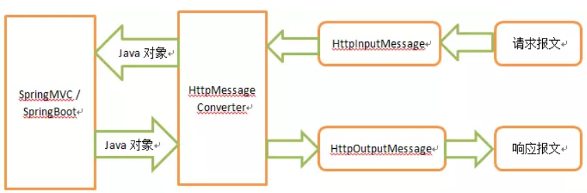

1、默认情况息  Spring boot web静态文件  放在 类路径下的:              
/static  
/public  
/resources  
/META-INF/resources  

在eclipse工程里看的话就是在  /main/resources 下
/main/resources/static 
/main/resources/public 
/main/resources/resources
/main/resources/META-INF/resources 
 

2、 替换默认配置   配置属性"spring.resources.static-locations"
   public static void main (String[] args) {

        SpringApplication app = new SpringApplication(ReplaceDefaultLocationsExample.class);
        Properties properties = new Properties();
        properties.setProperty("spring.resources.static-locations","classpath:/newLocation1/,classpath:/newLocation2/");
        app.setDefaultProperties(properties);
        app.run(args);
    }

3、使用jsp

   3.1添加依赖  
   	<!-- JSP related maven dependencies   begin -->  
	<dependency>  
		<groupId>org.apache.tomcat.embed</groupId>  
		<artifactId>tomcat-embed-jasper</artifactId>  
	</dependency>  
	<dependency>  
		<groupId>javax.servlet</groupId>  
		<artifactId>jstl</artifactId>  
	</dependency>  
	<!-- JSP related maven dependencies  end  -->  
	
	3.2 application.properties
	 增加属性配置  
	 spring.mvc.view.prefix= /WEB-INF/views/
	 spring.mvc.view.suffix= .jsp
	 
	 3.3  新建 jsp 在  resources/META-INF/resources/WEB-INF/views/myView.jsp  --- 注意位置
	 
	 3.4 controller  
	     	@RequestMapping("/")
			public String handler(Model model) {
				model.addAttribute("msg", "a jar packaging example");
				return "myView";
			}
	 
4、更换图标的话 放在  src/main/resources/favicon.ico

5、	 HttpMessageConverter
	 

自定义个       HttpMessageConverter :    com.yzl.study.spingboot.HttpMessageConverterConfig

6、 @ServletComponentScan  可以用来扫描  @WebServlet, @WebFilter and @WebListener  

7、不适用  @ServletComponentScan的话    可以直接  把 Servlet  等注册为 spring一个bean  来使用    

pring provides following classes to register servlet components as beans.

ServletRegistrationBean
FilterRegistrationBean
ServletListenerRegistrationBean

8、BeanNameViewResolver 默认会被注册  
  我们可以拿   View's bean name 作为 view name
  View's bean ： com.yzl.study.spingboot.MyCustomView
  
----------------------------------------------------------------------

9、Spring Boot Web MVC Auto Configuration  

   1、Servlet, DispatcherServlet and WebMvcConfigurer classes must be present on the classpath。
   If the dependency of spring-boot-starter-web has been included in the project then all of these classes will be present.
   
  2、  The application context being used must be web application context.   
     When we start spring boot application via SpringApplication class,  
     AnnotationConfigEmbeddedWebApplicationContext is initialized as ApplicationContext only if 
       ConfigurableWebApplicationContext is on the classpath (included when used spring-boot-starter-web),
       otherwise AnnotationConfigApplicationContext is initialized.
       
 3、WebMvcConfigurationSupport must not already be registered as bean. In a typical web MVC application,   
     this class is registered when we use @EnableWebMvc.    
     
     
10、 增加logback.xml 配置文件     
       
11、http://mybatis.org/spring-boot-starter/mybatis-spring-boot-autoconfigure/

12、增加 连接 mysql   增加 mybatis

注意mybatis.spring 版本匹配:  

MyBatis-Spring	MyBatis	Spring 框架	Spring Batch	Java
2.0	            3.5+	5.0+	    4.0+	        Java 8+
1.3	            3.4+	3.2.2+	    2.1+	        Java 6+

这里使用   1.3.5
		<dependency>
			<groupId>mysql</groupId>
			<artifactId>mysql-connector-java</artifactId>
			<version>8.0.11</version>
		</dependency>
		<dependency>
			<groupId>org.mybatis.spring.boot</groupId>
			<artifactId>mybatis-spring-boot-starter</artifactId>
			<version>1.3.5</version>
		</dependency>

application.properties 中配置  mybatis 属性：  
mybatis.mapper-locations=classpath:mapper/*.xml  
mybatis.configuration.map-underscore-to-camel-case=true  

 
另外注意一点  要配置  @MapperScan({"com.yzl.study.**.dao"})    

配置连接mysql8 的数据源：
spring.datasource.url=jdbc:mysql://127.0.0.1:3306/mddp_base_info_dev
spring.datasource.username=root
spring.datasource.password=root
spring.datasource.driver-class-name=com.mysql.cj.jdbc.Driver

要使用druid 的话  需要引入 依赖：

		<dependency>
		   <groupId>com.alibaba</groupId>
		   <artifactId>druid-spring-boot-starter</artifactId>
		   <version>1.1.17</version>
		</dependency>

		<dependency>
			<groupId>com.alibaba</groupId>
			<artifactId>druid</artifactId>
			<version>1.1.21</version>
		</dependency>

13、事物管理  @EnableTransactionManagement 

  
14、

